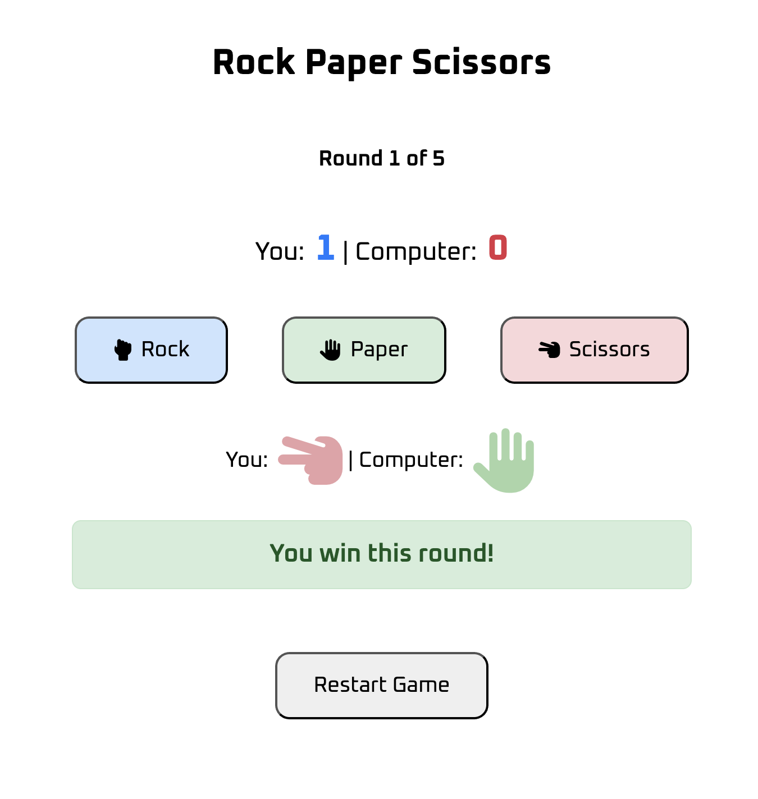

## Rock Paper Scissors Game

A simple web-based Rock Paper Scissors game built using **HTML**, **CSS** and **JavaScript**. The player competes against the computer by selecting rock, paper or scissors, and the game determines the winner based on classic rules.

## Features
- Interactive UI with Font Awesome icons
- Randomized computer choice on each round
- Dynamic score tracking for both player and computer
- Visual feedback on round results (e.g., win, lose, tie)
- Option to restart the game or play again after game over
- Clean and responsive design

## Preview

Here is how the game looks after a round has been played:

## Tech Stack
- **HTML** - Markup structure
- **CSS** - Styling and layout
- **JavaScript** - Game logic and interactivity
- **Font Awesome** - Icon set for game choices

## How to Play
1. Click on rock, paper or scissors to make your choice
2. The computer randomly selects its choice
3. The winner is decided based on the following rules:
   - Rock beats Scissors
   - Scissors beats Paper
   - Paper beats Rock
4. The results are shown and the scores update instantly
5. First to score 3 points or 5 rounds played ends the game

## Project Status
**Status:** Completed (for now)

## Future Improvements
- Add sound effects (button clicks, win, loss) for more immersive feedback
- Visual Effect for winning, losing
- Track win/loss history across games
- Add a toggle switch to change between light and dark modes